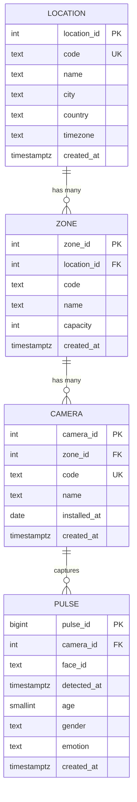

# Database design — entity relationship diagram

Data model for the office visitor-analytics platform.

## Scope

Four tables, matching the project hierarchy exactly:

```
Location  ->  Zone  ->  Camera  ->  Pulse
```

The required metrics — visits vs. visitors, visitor journeys, demographics
aggregation, happiness index — are **computed from `pulse` by backend query
logic**, not stored in their own tables. `pulse` is the single source of truth;
every derived figure can be recalculated from it.

## Diagram



## The core rule

A foreign key lives on the **many** side. One location has many zones, so
`location_id` is a column on `zone`. There is no list of zones stored inside a
location row — that is not how relational databases express "one to many".

## Relationships

| Relationship | Cardinality | Foreign key | Why it exists |
|---|---|---|---|
| `location` → `zone` | 1:N | `zone.location_id` | A zone is part of a site and cannot exist without one. Enables per-site rollups and multi-office support. |
| `zone` → `camera` | 1:N | `camera.zone_id` | A large area needs several cameras. This is what gives a raw detection its *place*. |
| `camera` → `pulse` | 1:N | `pulse.camera_id` | Provenance — every detection came from exactly one device. |

All three use `ON DELETE RESTRICT`: a parent row with children cannot be
deleted. The database refuses rather than orphaning or silently cascading.

A pulse stores only `camera_id`, yet `camera → zone → location` recovers the
rest by joining. Each fact is stored exactly once — that is normalisation.

## Why `face_id` is not a foreign key

`pulse.face_id` is assigned by the vision system and refers to no table in this
database. It is the column that makes unique-visitor counting possible:
`count(distinct face_id)` gives visitors, `count(*)` gives detections.

## Derived metrics

| Metric | Computed as |
|---|---|
| Visitors (unique) | `count(distinct face_id)` |
| Visits | Detections for one `face_id` grouped into sessions by a time gap |
| Visitor journeys | Pulses for one `face_id`, ordered by `detected_at`, joined to zones and collapsed into transitions |
| Demographics | `age` / `gender` resolved per `face_id` from its many per-detection estimates |
| Happiness index | Weighted average over `emotion` for a time window |

**Open decision:** the session gap that separates two visits by the same person.
The value determines the visits-to-visitors ratio directly and must be
documented rather than left implicit.

## Regenerating the diagram in pgAdmin

Right-click the `pulses` database in the Object Explorer → **ERD For Database**.
pgAdmin reads the foreign key constraints and draws the relationships
automatically.
